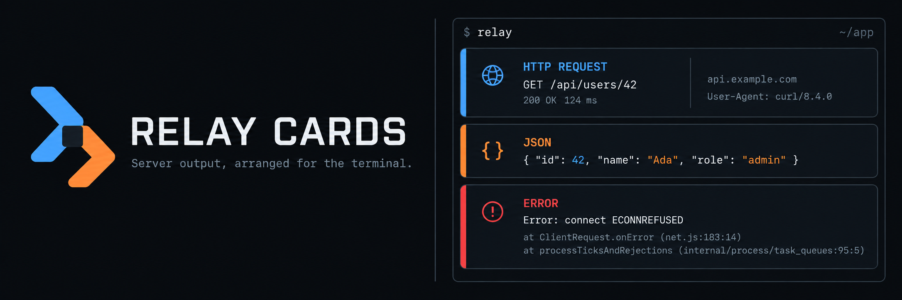

<p align="center">
  
</p>

Relay Cards runs a server command and presents its requests, structured output, errors, warnings, and process events as readable cards in the terminal.

It works with existing programs by reading standard output and standard error. Recognized lines receive a purpose-built card, while everything else remains available as ordinary text or through the raw-output view.

## Try the demo

```sh
npm install
npm run demo
```

The included server produces successful and failed HTTP requests, structured JSON, a warning, a multiline stack trace, and repeated worker messages. Press `?` to see the available controls and `q` to stop it.

For a non-interactive demonstration that exits on its own:

```sh
npm run demo:plain
```

## Run a command

```sh
relay-cards -- npm run dev
```

Arguments after `--` belong to the server command. The shorter form also works when the Relay options are unambiguous:

```sh
relay-cards node server.js
```

Piped output is accepted as well:

```sh
node server.js | relay-cards
```

When input or output is redirected, Relay Cards writes plain lines without interactive terminal control sequences.

## Controls

| Key      | Action                                                      |
| -------- | ----------------------------------------------------------- |
| `↑`, `k` | Select the previous event                                   |
| `↓`, `j` | Select the next event                                       |
| `g`, `G` | Jump to the first event or follow the latest one            |
| `Enter`  | Expand or collapse the selected card                        |
| `1`–`6`  | Toggle HTTP, JSON, error, warning, process, and text events |
| `/`      | Filter the visible feed by text                             |
| `r`      | Switch between cards and raw output                         |
| `p`      | Pause or resume the visible feed                            |
| `c`      | Clear event history                                         |
| `q`      | Stop the child command and exit                             |
| `?`      | Open the keyboard reference                                 |

## Recognized output

Relay Cards currently recognizes:

- JSON objects and arrays
- structured HTTP records containing `method`, `path` or `url`, and `status` or `statusCode`
- common and combined HTTP access logs
- simple `METHOD /path STATUS DURATION` access lines
- errors followed by JavaScript, Python, or Java-style stack frames
- warning lines beginning with `WARN` or `WARNING`
- process startup, running, stopping, and exit events

Malformed structured output becomes a text event. It is never silently discarded.

### Structured HTTP example

```json
{
  "method": "POST",
  "path": "/users",
  "status": 201,
  "durationMs": 12.5,
  "bytes": 128,
  "remoteAddress": "127.0.0.1"
}
```

## Options

```text
--history <count>  Number of events retained in memory (default: 500)
--no-coalesce      Keep repeated consecutive events separate
--plain            Disable the interactive interface
-h, --help         Show command help
-v, --version      Show the version
```

The interactive feed groups consecutive identical events for one second by default. The history limit prevents a long-running process from growing memory use without a bound.

## Use the components

The package exports the parser pipeline, event store, process runner, card components, and complete Ink application.

```tsx
import {render} from 'ink';
import {EventStore, RelayCardsApp, runCommand} from '@relay-cli/server-cards';

const store = new EventStore({limit: 500});
const running = runCommand(['node', 'server.js'], {
  onEvent: (event) => store.append(event),
});

const app = render(
  <RelayCardsApp
    store={store}
    commandLabel={running.displayCommand}
    onQuit={() => running.stop()}
  />,
);

await running.completion;
app.unmount();
```

## Development

```sh
npm install
npm run check
```

`npm run check` verifies formatting, linting, types, tests, and the production build.

## License

MIT
